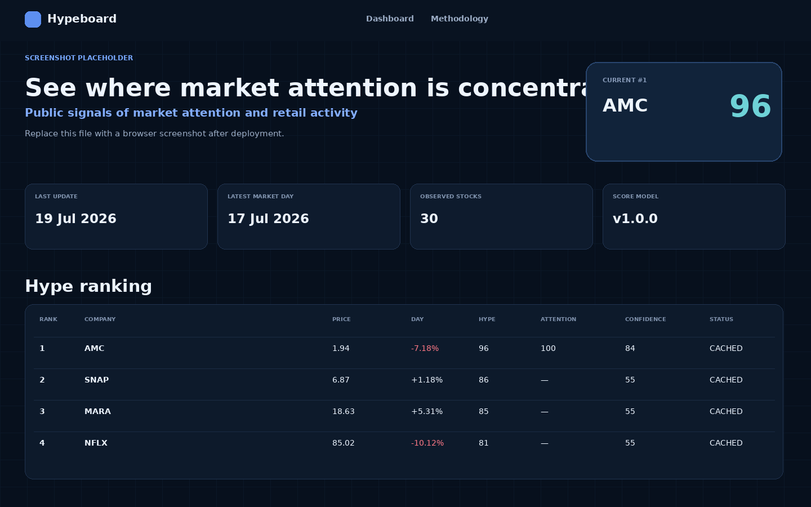
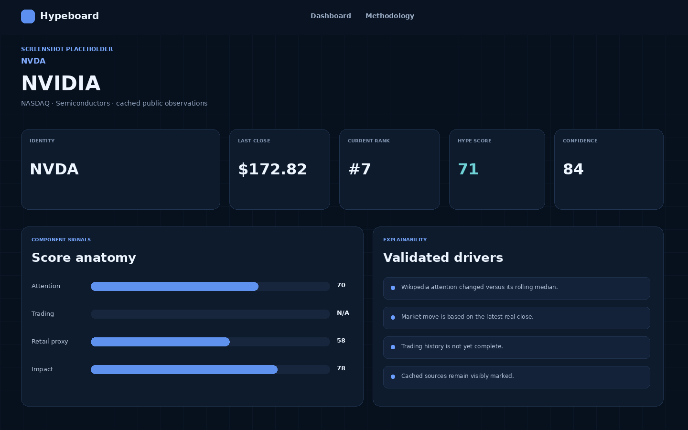

# Hypeboard

**Public signals of market attention and retail activity**

Hypeboard ist ein öffentliches Browser-Dashboard, das täglich aktualisierte, öffentlich verfügbare Signale zu Aktien bündelt. Es macht sichtbar, welche Titel im beobachteten Universum momentan außergewöhnlich viel öffentliche Aufmerksamkeit, ungewöhnliche Handelsaktivität oder weitere Merkmale retailgeprägter Marktaktivität aufweisen.

Hypeboard misst **keinen exakten Retail-Anteil** und kennt keine privaten Brokerpositionen. Ein Hype Score von 85 bedeutet ausschließlich, dass eine Aktie im aktuellen Vergleichsuniversum einen sehr hohen kombinierten Aufmerksamkeits- und Aktivitätswert besitzt.

> **Rechtlicher und methodischer Hinweis:** Hypeboard stellt keine Anlageberatung und keine Kauf- oder Verkaufsempfehlung dar. Die dargestellten Werte basieren auf öffentlichen Marktdaten und Näherungsindikatoren. Der Hype Score misst keine exakten Brokerpositionen und keinen exakten Anteil von Privatanlegern.

## Screenshots

Die Dateien unter `docs/screenshots/` sind bewusst gekennzeichnete visuelle Platzhalter. Nach dem ersten Deployment können sie durch echte Browser-Screenshots ersetzt werden.

| Dashboard | Aktien-Detailseite |
|---|---|
|  |  |

## Funktionsumfang

Die erste produktive Version enthält:

- ein responsives React-Dashboard mit Dark Mode als Standard,
- ein Ranking für 30 konfigurierbare US-Aktien,
- Suche, Sortierung, Sektorfilter und Mindest-Confidence,
- eine lokale Browser-Watchlist ohne Nutzerkonto,
- Tabellen- und Kartenansicht,
- Detailseiten mit Score-Zusammensetzung, Treibern, historischen Signalen und Quellenstatus,
- eine ausführliche Methodikseite,
- eine modulare Python-Datenpipeline,
- versionierte, transparente Scores,
- isolierte Datenquellen mit Retry, Timeout und Cache-Fallback,
- Pydantic-validierte JSON-Verträge,
- Python- und Frontendtests,
- tägliche Aktualisierung und GitHub-Pages-Deployment über GitHub Actions.

## Architekturentscheidung

Hypeboard verwendet eine **statische Datenprodukt-Architektur**:

```text
Public data providers
        │
        ▼
Python source adapters
        │ raw cache + source status
        ▼
Normalization and scoring
        │ Pydantic validation
        ▼
Versioned JSON files
        │
        ▼
React / Vite static frontend
        │
        ▼
GitHub Pages
```

Damit ist kein dauerhaft laufender Server erforderlich. Die Komponenten sind dennoch so getrennt, dass später FastAPI, PostgreSQL, Supabase oder ein Intraday-Worker ergänzt werden können. Das Frontend kennt keine providerspezifischen Antworten, sondern ausschließlich den stabilen JSON-Datenvertrag.

Eine ausführlichere Entscheidung steht in [`docs/architecture.md`](docs/architecture.md).

## Projektstruktur

```text
hypeboard/
├── frontend/
│   ├── src/
│   │   ├── components/
│   │   ├── pages/
│   │   ├── hooks/
│   │   ├── services/
│   │   ├── types/
│   │   ├── utils/
│   │   └── styles/
│   ├── public/data/
│   ├── package.json
│   └── vite.config.ts
├── pipeline/
│   ├── sources/
│   ├── scoring/
│   ├── models/
│   ├── validation/
│   ├── config/
│   └── run_pipeline.py
├── data/
│   ├── raw/
│   ├── processed/
│   ├── history/
│   └── metadata/
├── tests/
├── docs/
├── .github/workflows/
├── .env.example
├── requirements.txt
└── README.md
```

## Datenquellen

### 1. Market Data – Stooq CSV Adapter

Datei: `pipeline/sources/market_data.py`

Der Adapter ruft öffentliche tägliche OHLCV-Daten über den Stooq-CSV-Endpunkt ab. Die Providerlogik ist vollständig gekapselt; der Rest der Pipeline hängt nicht direkt von Stooq ab.

- **Frequenz:** tägliche End-of-Day-Daten
- **Verzögerung:** providerabhängig; nicht als Echtzeitquelle behandeln
- **Rate Limit:** für den CSV-Endpunkt ist kein belastbares offizielles SLA oder öffentlich garantiertes Limit dokumentiert
- **Schutzmaßnahmen:** serieller Abruf, konfigurierbare Pause, Timeout, begrenzte Retries und lokaler Cache
- **Nutzungsbedingungen:** vor kommerzieller Nutzung müssen die jeweils aktuellen Bedingungen des Anbieters geprüft werden

Der mitgelieferte Offline-Snapshot enthält reale, datierte Marktbeobachtungen und wird nur verwendet, wenn kein Netzwerk verfügbar ist. Er ist nicht als Live-Stand zu interpretieren und wird als `cached` markiert.

### 2. Wikimedia Pageviews API

Datei: `pipeline/sources/wikipedia.py`

Die Pipeline ruft tägliche Seitenaufrufe der konfigurierten Unternehmensseiten über die offizielle Wikimedia Pageviews API ab.

- **Frequenz:** täglich
- **Verzögerung:** der jüngste vollständige UTC-Tag kann zeitverzögert verfügbar sein
- **Identifikation:** ein beschreibender `User-Agent` ist erforderlich
- **Metrik:** öffentliche Aufmerksamkeit, nicht Stimmung oder Kaufabsicht
- **Dokumentation:** https://wikitech.wikimedia.org/wiki/Analytics/AQS/Pageviews

### 3. FINRA Consolidated Short Sale Volume

Datei: `pipeline/sources/finra_short_volume.py`

Die Pipeline lädt die täglichen konsolidierten FINRA-Dateien für NMS-Wertpapiere und berechnet unter anderem das Verhältnis von Short Volume zu Total Volume.

- **Frequenz:** Handelstage
- **Veröffentlichung:** normalerweise bis etwa 18:00 Uhr US Eastern Time
- **Abdeckung:** gemeldete außerbörsliche Transaktionen über TRFs/ADF; keine vollständige konsolidierte Börsensicht
- **Wichtige Einschränkung:** Daily Short Sale Volume ist **nicht** dasselbe wie Short Interest
- **Dokumentation:** https://www.finra.org/finra-data/browse-catalog/short-sale-volume-data

### 4. Social Attention – optional und standardmäßig deaktiviert

Datei: `pipeline/sources/social.py`

Hypeboard scrapt keine eingeloggten Plattformen und reverse-engineert keine Broker- oder Social-Media-Apps. Ein Social-Adapter wird nur aktiv, wenn `HYPEBOARD_SOCIAL_DATA_URL` auf einen legal zugänglichen, dokumentierten JSON-Feed gesetzt wird.

Erwartetes Minimalformat:

```json
{
  "records": [
    { "symbol": "NVDA", "date": "2026-07-19", "mentions": 1234 }
  ]
}
```

Ohne Feed ist die Quelle ausdrücklich `unavailable`. Fehlende Social-Werte werden nicht als null interpretiert und nicht erfunden.

## Datenmodell

Das Frontend liest ausschließlich statische JSON-Dateien:

- `frontend/public/data/latest.json`
- `frontend/public/data/meta.json`
- `frontend/public/data/history/<SYMBOL>.json`

`latest.json` enthält Ranking, Scores, Kursdaten, Treiber, Quellenzeitpunkte, Score-Abdeckung und Datenstatus. `meta.json` dokumentiert den Gesamtupdate-Status und alle Quellen. Jede History-Datei enthält den zeitlichen Verlauf eines Symbols.

Pydantic-Modelle liegen in `pipeline/models/domain.py`. JSON-Schemas werden bei jedem Pipeline-Lauf nach `pipeline/validation/schemas/` exportiert.

## Score-Modell

Die zentrale, versionierte Konfiguration liegt in:

```text
pipeline/config/score_config.json
```

### Komponenten

```text
Attention Score
= 55% Wikipedia-/Suchaufmerksamkeitsschock
+ 45% Social-Media-Aufmerksamkeit

Trading Score
= 60% ungewöhnliches Aktienvolumen
+ 25% absolute Tagesbewegung
+ 15% Volatilitätsschock

Retail Proxy Score
= 50% kurzfristige retailnahe Aktivitätssignale
+ 30% Short-Sale-Volumenveränderung
+ 20% zusätzliche Retail-Proxys

Impact Score
= 45% Preisbewegung je Dollarvolumen
+ 30% Liquiditätssensitivität
+ 25% Größe des Aufmerksamkeitsschocks

Hype Score
= 40% Attention Score
+ 35% Trading Score
+ 15% Retail Proxy Score
+ 10% Impact Score
```

### Robuste Normalisierung

Die Pipeline verwendet:

- rollierende Mediane,
- Median Absolute Deviation,
- begrenzte robuste Z-Werte,
- Perzentil-Ränge von 0 bis 100,
- Mindesthistorien je Signal,
- Mindestabdeckung je Score-Komponente.

Fehlen Komponenten, werden Gewichte nur dann über vorhandene Inputs renormalisiert, wenn die konfigurierte Mindestabdeckung erreicht ist. Die effektive Abdeckung wird als `score_coverage` ausgegeben.

### Confidence Score

Der Confidence Score kombiniert:

- Datenvollständigkeit: 35%,
- Aktualität: 20%,
- unabhängige Quellen: 20%,
- Historienlänge: 15%,
- Proxy-Qualität: 10%.

Confidence und Hype sind bewusst getrennt. Ein hoher Hype Score kann mit niedriger Confidence auftreten und wird im Frontend entsprechend gekennzeichnet.

### Erklärbare Treiber

Treibertexte werden deterministisch aus berechneten Messwerten erzeugt. Es wird kein Sprachmodell verwendet. Beispiele werden nur ausgegeben, wenn die zugrunde liegende Kennzahl tatsächlich vorhanden ist.

## Aktienuniversum erweitern

Das Universum liegt in `pipeline/config/universe.json`. Neue Aktien erfordern keine Änderungen am Kerncode.

Beispiel:

```json
{
  "symbol": "XYZ",
  "company_name": "Example Corporation",
  "exchange": "NASDAQ",
  "sector": "Technology",
  "wikipedia_page": "Example_Corporation",
  "aliases": ["XYZ stock", "Example Corp"],
  "active": true
}
```

Danach:

```bash
python -m pipeline.run_pipeline
pytest
```

## Neue Datenquelle ergänzen

1. Von `SourceAdapter` in `pipeline/sources/base.py` ableiten.
2. Providerantworten in ein tabellarisches, datiertes Signalformat überführen.
3. Pro Abruf einen `SourceRunStatus` erzeugen.
4. Timeout, Retry und Cache-Fallback des Basismoduls verwenden.
5. Niemals fehlende Werte als null oder erfundene Ersatzwerte einfügen.
6. Adapter in `pipeline/run_pipeline.py` registrieren.
7. Score-Konfiguration versionieren, falls die Quelle einen Score beeinflusst.
8. Tests für Erfolg, Fehler, Cache und unvollständige Daten ergänzen.

## Lokale Installation

### Voraussetzungen

- Python 3.12
- Node.js 22 oder neuer
- npm

### Python-Pipeline

```bash
python -m venv .venv
source .venv/bin/activate
pip install -r requirements.txt
cp .env.example .env
python -m pipeline.run_pipeline
```

Windows PowerShell:

```powershell
python -m venv .venv
.venv\Scripts\Activate.ps1
pip install -r requirements.txt
python -m pipeline.run_pipeline
```

Offline mit dem letzten erfolgreichen Cache beziehungsweise dem mitgelieferten realen Snapshot:

```bash
python -m pipeline.run_pipeline --offline
```

Ausgabe validieren:

```bash
python -m pipeline.validation.validate_output
```

### Frontend

```bash
cd frontend
npm install
npm run dev
```

Produktions-Build:

```bash
npm test
npm run build
npm run preview
```

Das Hash-Routing funktioniert auf GitHub Pages ohne Server-Rewrite-Regeln.

## Tests

### Python

```bash
pytest
```

Abgedeckt sind unter anderem:

- robuste Normalisierung,
- Mindesthistorie,
- Score-Berechnung und Renormalisierung,
- fehlende Komponenten,
- unvollständige Quellen,
- Score-Grenzen von 0 bis 100,
- Pydantic- und JSON-Schema-Verträge,
- doppelte Symbole,
- doppelte Handelstage,
- unrealistische Kurs- oder Volumenwerte,
- vollständige History-Abdeckung.

### Frontend

```bash
cd frontend
npm test
npm run build
```

Abgedeckt sind zentrale Score-Komponenten, alle Datenstatus, fehlende Scores und der JSON-Ladefehlerzustand. `tsc` läuft im Strict Mode ohne vermeidbare `any`-Typen.

## GitHub Actions

### Continuous Integration

`.github/workflows/ci.yml` läuft bei Pushes, Pull Requests und manuell:

1. Python 3.12 einrichten
2. Python-Abhängigkeiten installieren
3. Pytest ausführen
4. Offline-Ausgaben reproduzieren
5. JSON validieren
6. Node.js einrichten
7. Frontendtests ausführen
8. Produktions-Build erzeugen

### Tägliches Update

`.github/workflows/daily-update.yml` läuft täglich um **23:37 Uhr Europe/Berlin** und zusätzlich über `workflow_dispatch`.

Ablauf:

1. Repository auschecken
2. Python installieren
3. Tests ausführen
4. den letzten erfolgreichen Provider-Cache über GitHub Actions Cache wiederherstellen
5. öffentliche Datenquellen abrufen und neue Rohdaten cachen
6. Signale normalisieren
7. Scores und Treiber berechnen
8. Datenverträge validieren
9. Frontend-JSON erzeugen
10. Frontend testen und bauen
11. Update-Bericht als Workflow Summary und Artifact speichern
12. geänderte Datenstände committen
13. GitHub Pages deployen

Fällt eine Quelle aus, versucht die Pipeline den letzten erfolgreichen realen Cache zu nutzen. Die source-spezifischen Cache-Verzeichnisse werden zwischen den ansonsten kurzlebigen GitHub-Runnern mit `actions/cache` weitergegeben. Der betroffene Status bleibt sichtbar und wird nicht als frisch ausgegeben.

## GitHub Pages veröffentlichen

1. Repository zu GitHub pushen.
2. Unter **Settings → Pages → Build and deployment** als Quelle **GitHub Actions** auswählen.
3. Unter **Actions** den Workflow **Daily data update and Pages deployment** manuell starten.
4. Nach erfolgreichem Lauf erscheint die URL im Deployment-Job und in der GitHub-Pages-Umgebung.

Das Vite-Frontend nutzt `base: './'` und Hash-Routing, sodass auch Projektseiten unter `https://<user>.github.io/<repository>/` funktionieren.

## Variablen und Secrets

### Für die aktiven Standardquellen erforderlich

Keine API-Schlüssel.

Empfohlene Repository-Variable:

| Name | Typ | Zweck |
|---|---|---|
| `HYPEBOARD_USER_AGENT` | GitHub Actions Variable | Beschreibender User-Agent mit Kontaktmöglichkeit, insbesondere für Wikimedia |

Optionales Secret:

| Name | Typ | Zweck |
|---|---|---|
| `HYPEBOARD_SOCIAL_DATA_URL` | GitHub Actions Secret | URL eines legal zugänglichen, Hypeboard-kompatiblen öffentlichen JSON-Feeds |

API-Schlüssel für künftige Anbieter gehören ausschließlich in GitHub Secrets oder lokale Umgebungsvariablen. Sie dürfen niemals in `frontend/`, JSON-Ausgaben oder das Repository geschrieben werden.

## Ausfallsicherheit

Alle Netzwerkadapter verwenden:

- konfigurierbare Timeouts,
- begrenzte Retry-Logik mit exponentiellem Backoff,
- isolierte Fehlerbehandlung pro Quelle,
- source-spezifische Rohdaten-Caches,
- sichtbare Statuswerte `fresh`, `cached`, `stale`, `partial`, `unavailable`,
- keine stillschweigende Nullsetzung,
- keine erfundenen Ersatzwerte.

Demo-Daten sind nicht Teil des produktiven Updatepfads. `HYPEBOARD_DEMO_MODE=true` führt absichtlich zu einem Fehler, solange kein separat implementierter und klar gekennzeichneter Demo-Pfad existiert.

## Wochenenden und Feiertage

Die History wird nach Symbol und Datum zusammengeführt und validiert. Liegt kein neuer Handelstag vor, wird kein doppelter Markttag erzeugt. Wikimedia-Aufmerksamkeitsdaten können an Wochenenden weiterlaufen und erscheinen als partielle Beobachtungen.

## Fehlerbehebung

### Frontend zeigt „Dashboard data could not be loaded“

```bash
python -m pipeline.run_pipeline --offline
ls frontend/public/data/latest.json
cd frontend
npm run dev
```

Prüfe außerdem, dass `vite.config.ts` den relativen Base-Pfad verwendet.

### Wikimedia antwortet mit 403 oder 429

- `HYPEBOARD_USER_AGENT` mit einer echten Kontaktmöglichkeit setzen.
- Request-Frequenz nicht erhöhen.
- Nach dem Cache-Fallback im `meta.json` den Quellenstatus prüfen.

### Stooq liefert keine Daten für ein Symbol

- Mapping im Market-Data-Adapter prüfen.
- Börsen- und Symbolformat kontrollieren.
- Letzten Cache nicht löschen, bevor der Providerfehler verstanden ist.
- Einen alternativen Anbieter als neuen Adapter ergänzen, statt Providerlogik im Scoring zu verteilen.

### FINRA-Datei fehlt

An Wochenenden, Feiertagen oder vor der Veröffentlichung kann die Datei für das erwartete Datum fehlen. Der Adapter sucht rückwärts nach Handelstagen und erzeugt keine künstliche Beobachtung.

### GitHub Pages zeigt eine leere Seite

- Pages-Quelle auf **GitHub Actions** setzen.
- prüfen, ob `frontend/dist/index.html` im Build-Artefakt liegt,
- Browser-Konsole auf fehlende `data/*.json` prüfen,
- den Workflow-Job `Deploy to GitHub Pages` öffnen.

## Datenqualität und Update-Bericht

Bei jedem Lauf werden unter anderem geprüft:

- konfigurierte Aktienanzahl,
- doppelte Symbole,
- vollständige History-Dateien,
- doppelte oder unsortierte Datumswerte,
- fehlende Zeitstempel,
- Score-Grenzen,
- unrealistische Kurse und Volumina,
- ungewöhnlich enge Score-Verteilung,
- extreme Rangveränderungen.

Der Bericht liegt in:

```text
data/metadata/update-report.md
```

## Erweiterungspfad

Die aktuelle Architektur bereitet folgende Erweiterungen vor, implementiert sie aber noch nicht:

- PostgreSQL oder Supabase als historischer Speicher,
- FastAPI als API-Schicht,
- Vercel-Deployment,
- Intraday-Worker,
- Optionsdaten,
- News- und Sentimentadapter,
- deutsche und europäische Aktien,
- LS-Exchange- und Tradegate-Daten,
- Nutzerkonten und serverseitige Watchlists,
- Benachrichtigungen bei Score-Sprüngen,
- historische Backtests,
- Forward-Return-Analysen,
- öffentliche REST-API.

Die Adapter-, Modell- und Scoringpakete enthalten keinen Frontendcode. Der statische JSON-Vertrag kann später direkt zum REST-Response-Schema werden.

## Aktueller Integrationsstatus

| Bereich | Status |
|---|---|
| React / TypeScript / Vite | aktiv |
| GitHub-Pages-kompatibles Hash-Routing | aktiv |
| ECharts | aktiv, lazy-loaded auf Detailseiten |
| Stooq Market Data Adapter | aktiv |
| Wikimedia Pageviews Adapter | aktiv |
| FINRA Short Sale Volume Adapter | aktiv |
| Social Attention Adapter | optional, standardmäßig deaktiviert |
| Optionsdaten | noch nicht implementiert |
| News / Sentiment | noch nicht implementiert |
| Brokerbezogener Orderflow | absichtlich nicht implementiert |
| Backend / Datenbank | noch nicht erforderlich |

## Lizenz

MIT, siehe [`LICENSE`](LICENSE). Datenquellen unterliegen ihren jeweiligen Bedingungen; die MIT-Lizenz des Quellcodes überträgt keine Rechte an externen Daten.
